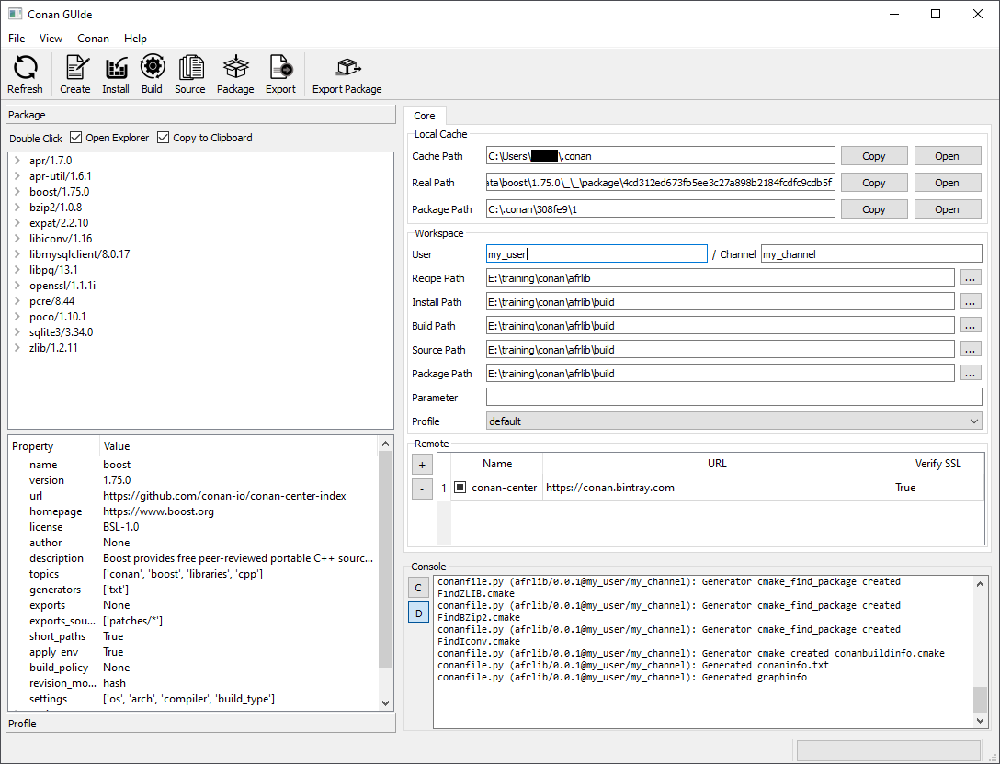

# Conan GUIde
Conan GUIde is Qt based Graphical User Interface (GUI) to interact with conan package manager. Conan GUIde provides user an easy overview of the information from the local cache without any further effort of typing in the terminal. One of the core functionalities from this application is to provide user the possibility to execute the conan development flow from the existing conan recipe.



**⚠ WARNING:** Currently only tested in Windows

## Table of Content
* [Requirements](#Requirements)
* [Features](#Features)
* [Usage](#Usage)
* [Contribution](#Contribution)
* [License](#License)

## Requirements
* Python >= 3.5
* Conan >= 1.35 - `pip install conan`
* PySide2 - `pip install PySide2`
* pyperclip - `pip install pyperclip`
* Operating System with activated GUI

## Features
* Execution of conan development flow:
    * `create`
    * `install`
    * `build`
    * `source`
    * `package`
    * `export`
    * `export-pkg`
* Display existing conan packages from the local cache
* Display package detail information
* Display list of profiles and its information
* Display list of existing remotes
* Console output

## Usage
```
git clone https://github.com/afri-bit/conan-guide.git
cd conan-guide
pip install .

# Start Conan GUIde
conan-guide
```

## Contribution
Please refer to [Contributing](CONTRIBUTING.md).

## License
**Conan GUIde** is licensed under the [MIT](LICENSE) license.  
Copyright © 2021, Afrizal Herlambang
